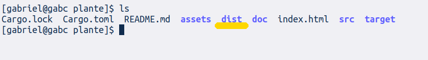

# Plantê
Plantê é um **projeto avaliativo da disciplina de programação para web** do curso de ciência da computação da UFOPA. É um sistema de comércio de plantas ornamentais e medicinais. Adicionalmente, produtos relacionados, como vasos de plantas, podem ser tratados pelo sistema.

## Protótipo de tela
[Prototipo de tela](doc/telas.pdf)

## Documento de visão
[Documento de visão](doc/dv.pdf)

## Suma dos requisitos funcionais
- Gerenciamento de usuários
- Pesquisa, filtragem e consulta de produtos
- Carrinho de produtos
- Compra de produtos

## Avanços na segunda entrega
Poucos avanços ocorreram em comparação à primeira entrega, em decorrência de um problema que tive.  
O que se tem no momento é a interface de usuário estilizada, faltando algumas poucas alterações, e inclusão de interatividade.  
Este sistema é escrito em Rust, e fiz experimentos em outros projetos para implementar neste.

## Instruções de compilação
Dependências:  
- Rust e ferramentas relacionadas. [RustUp](https://rustup.rs/).  
- [Trunk](https://trunkrs.dev/)  
- [Yew](https://yew.rs/)  
- [wasm-bindgen](https://lib.rs/crates/wasm-bindgen)

**Procedimento**:  
1. Descarregar/clonar este repositório:
<code>
git clone https://github.com/gabcchaves/plante.git && cd plante
</code>

2. Caso se deseje apenas testar, sem usar um servidor web terceiro, basta invocar o empacotador **trunk** deste modo:
<code>
trunk serve
</code>

Caso se deseje usar o sistema em "produção", compila-se o sistema deste modo, com **trunk**:  
<code>
trunk build --target web
</code>  
Isto deverá resultar na distribuição do sistema, que corresponde ao directório <code>dist</code>, presente no directório do projeto. Deve-se modificar o arquivo <code>index.html</code>, corrigindo os caminhos das etiquetas <code>link</code>, conforme a organização dos diretórios do servidor web, a menos que a distribuição (os arquivos dentro do diretório <code>dist</code>) seja movida para a raíz do servidor web.

